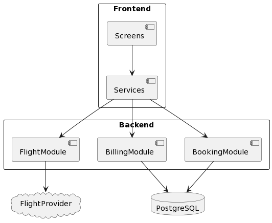

# Flights-app
Este sencillo y asombroso projecto permite comprar tiquetes aereos a través de una interfaz con 4 pasos: ciudad origen, ciudad destino, información de  pasajeros y facturación. Flights-app usa React como framework en el Frontend junto con MaterialUI, para el backend utiliza Java con Springboot; JPA e Hibernate y PostreSQL como base de datos.

https://flights-app-sebas.herokuapp.com/

## Arquitectura
Flights-app posee una arquitectura de capas que está dividida en dos: Frontend y Backend.

### Frontend
El Frontend se construyo con una arquitectura de dos capas: Pantallas y Servicio.
    - Pantallas:
        - BookingScreen:
        - HomeScreen:
    - Servicios:
        - BillingService:
        - FlightService:
        - SharedServices:
        
### Backend

#### DomainModel

## Características
- [x] El usuario ingresa a la página de nuestra aerolínea y selecciona cual es la ciudad de origen, y la ciudad de destino.
- [x] La ciudad de destino se debe cargar según el origen seleccionado, ya que de un origen no se vuela a todos los destinos.
- [x] El usuario debe seleccionar si se trata de un vuelo RT (ida y regreso) o un vuelo OW (un sólo trayecto).
- [x] Se brinda al usuario la posibilidad de seleccionar la fecha de ida y la fecha de regreso o solo la fecha de ida de acuerdo a si es un vuelo RT o OW.
- [x] El usuario selecciona la cantidad de viajeros que desean viajar y da clic en continuar e indicar cuántos son adultos, niños (mayores de 2 años) o infantes (menores de 2 años).
- [x] Al dar clic en continuar el sistema debe mostrar al usuario los vuelos de ida y de regreso de acuerdo con la selección de RT o OW con su respectiva hora de partida, la duración del vuelo y si es directo o tiene escalas y el precio del vuelo de ida, según las fechas seleccionadas.
- [x] Del listado el usuario selecciona una opción de vuelo y continúa el proceso.
- [x] Dependiendo de si es un vuelo RT, el siguiente paso es igual al anterior, solo que se muestran los vuelos de regreso. El usuario selecciona una opción y el sistema debe de mostrar el total a pagar del viaje y el valor unitario de cada tiquete.
- [x] Si el usuario desea continuar, da clic y el sistema muestra una pantalla donde solicita la información de cada uno de los pasajeros. Dicha información es el número de identificación (cédula, pasaporte,etc.), el nombre de cada pasajero, el apellido de cada pasajero, el teléfono de cada pasajero, el correo electrónico de cada pasajero y la edad de cada pasajero. En caso de que la ciudad destino requiera VISA se solicita la fecha de vencimiento de dicho documento. Luego da clic en continuar.

## Requisitos
- [x] Identificar con el número del pasajero si el cliente es un viajero frecuente, en caso de serlo mostrarle cuantas millas tiene actualmente y cuántas va a acumular con el viaje.
- [x] Si el viajero ha viajado más de 10 veces en el mismo año hacerle un descuento del 10% en el valor de su tiquete si es un viajero frecuente, en caso de no serlo solo se hará un descuento del 5%.
- [x] Por políticas de la empresa si existe un viajero mayor de 65 años se le hará un descuento en su tiquete del 3% adicional independiente si es o no viajero frecuente.
- [ ] Todo niño mayor de 2 años debe ocupar una silla, por lo cuál se le debe generar tiquete a la tarifa normal, si es menor de 2 años se cobra solo el 10% de la tarifa normal.
- [] Paso seguido el usuario da clic en pagar y se deben generar los tiquetes, los cuales van a ser enviados por correo electrónico y en formato PDF a cada uno de los viajeros. Este correo se debe enviar de manera asíncrona ya que al usuario se le debe dar respuesta de inmediato que su reserva quedó realizada y se debe mostrar el número de la reserva.

STILL IN PROCESS